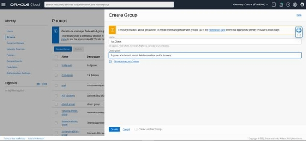
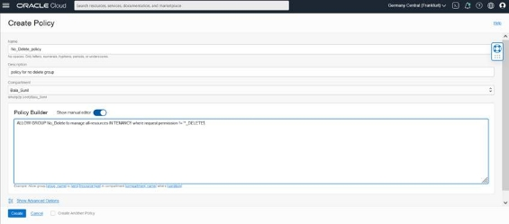
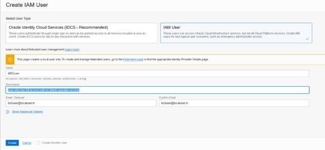
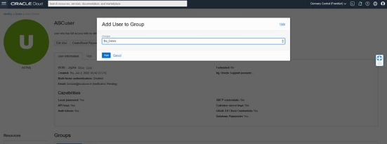
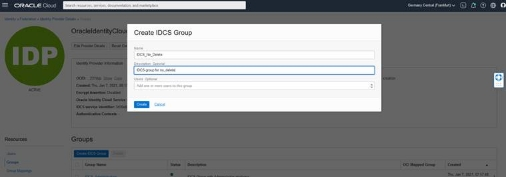
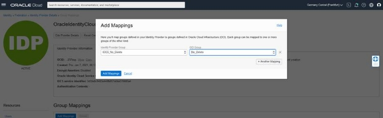
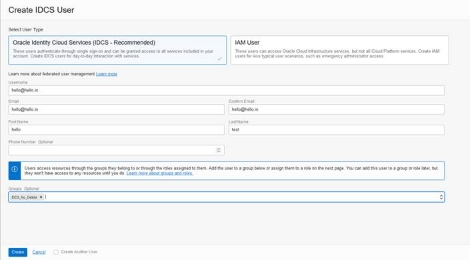
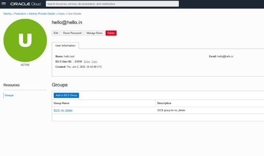

# How to prevent accidental deletion on OCI?

# **Scenario:**
# **Onboard a new guy to production OCI environment. So to avoid any resource deletion, implement the below setup.** 
# **A user who is new to OCI or a new guy who wanted to learn or implement a setup on OCI. He require admin access to accomplish the requirement.** 

# **No Delete group and policy setup on Oracle Cloud Infrastructure using a single line policy statement.** 
## **Login to the tenancy and verify the user has access OCI Administrator & IDCS Administrator(Optional) access.**
## **To implement the below setup for IDCS federated tenancy and the users are creating as a federated user, then the user who creating the setup should have IDCS Administrator access as well.**
**Step 1**

Create a group called "No\_Delete" 

Menu → Identity & Security → Groups
-------------------------------------

#### **Step 2** 
Create a policy called "**No\_Delete\_policy**"  for the group "**No\_Delete"** 

Menu → Identity & Security → Policies 

Under Policy Builder toggle Show manual editor and enter the below statement (This is generic one)
### **ALLOW GROUP No\_Delete to manage all-resources IN TENANCY where request.permission != '\*\_DELETE'**
The above policy is for tenancy level full access. If we need to restrict with compartment level full access with no delete operation follow the below syntax. The below one is recommended.
### **ALLOW GROUP No\_Delete to manage all-resources IN COMPARTMENT <Compartment\_Name> where request.permission != '\*\_DELETE'**

Once the above group and policy are created then add the user account to the above group "**No\_Delete**" . Now who all are added to the group have full access to the Tenancy/Compartment except the delete operation.

**Note: As the user has full access to the tenancy, so the user itself can add his user to Administrator group or change polices. If you want to restrict that add the below condition to the policy statement.**  

ALLOW GROUP <Group\_name> to manage all-resources IN TENANCY where all{request.permission != '\*\_DELETE' , request.operation !='ListGroups', request.operation !='ListPolicies', request.operation !='ListDynamicGroups'}

### **Step 3**
Add OCI Local user Accounts 

Menu → Identity & Security → Users

Click create user. Select IAM user (Which is OCI local user account)

Once the OCI local user is created, add that user to the group "**No\_Delete**"

Menu → Identity & Security → Users

Select the user. Under Groups tab click Add user to group and select the group "**No\_Delete**"

The above two 3 steps are applicable of OCI Local user accounts. 

If the user account is going to create as an IDCS federated user account. Perform the below steps. As mentioned above for performing the step 4. The user who performing this setup should have IDCS Administrator access.

#### **Step 5**
Create a group on IDCS

Menu → Identity & Security → Federation

Click OracleIdentityCloudService. Select Groups under the Resources. 

Click Create IDCS Group called "**IDCS\_No\_Delete"** 

#### **Step 6**
Map the IDCS group to OCI Group 

Menu → Identity & Security → Federation

Click OracleIdentityCloudService. Select Group Mappings under the Resources. 

Click Add Mappings. Select Identity Provider Group as "**IDCS\_No\_Delete**"   and OCI Group  as "**No\_Delete**" 

So the OCI group is successfully mapped with IDCS group 
#### **Step 7**
Add IDCS Federated user Accounts 

Menu → Identity & Security → Users

Click Create User. Select user type Oracle Identity Cloud Services (IDCS - Recommended). Fill the user details and select group as "**IDCS\_No\_Delete**" 

## **Once the above step done, The IDCS user has full access to the tenancy/Compartment except delete operation** 

Thanks 

